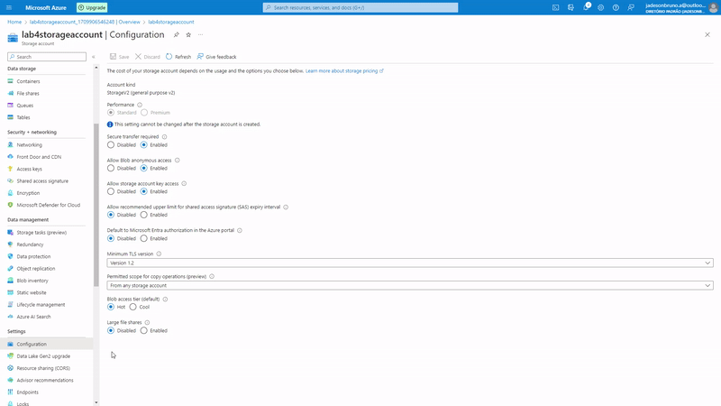

# Cognitive Search in Microsoft Azure

This repository has the purpose of storing the project developed within the scope of the "Document Intelligence and Knowledge Mining" module of the "Microsoft Azure AI Fundamentals" Bootcamp by [DIO](https://www.dio.me/), under the instruction of the teacher [Valéria Baptista](https://www.linkedin.com/in/valeriabaptista/).

The project is an essential requirement for passing the "Document Intelligence and Knowledge Mining" module, consolidating participants practical learning and preparing them for subsequent challenges.

The development of this project aims to demonstrate how knowledge mining can be used in Microsoft Azure, creating Azure AI Search indexes alongside AI capabilities. For a better understanding, I divided the entire process into steps, from creating resources to obtaining insights with cognitive research.

## Problem Context 

Let’s imagine you work for Fourth Coffee, a national coffee chain. You’re asked to help build a knowledge mining solution that makes it easy to search for insights about customer experiences. You decide to build an Azure AI Search index using data extracted from customer reviews.

## Step 1: Creating a resource Azure AI Search

Inicialmente, precisamos acessar o portal do Azure: https://portal.azure.com/.

To start retrieving this information we need to create some resources, the first of which is Azure AI Search.

  

You need to fill in some information to create the resource.

  

After reviewing the resource, we can create.

  

After the deployment is complete, let's move on to the next step.

  

## Step 2: Creating a resource Azure AI Service

Let's select the Azure AI Service resource.

  

You need to fill in some information to configure the feature.

  

After reviewing the resource, we can create.

  

After the deployment is complete, let's move on to the next step.

  

## Step 3: Creating Storage Account

We need to create a storage account because it will provide us with a unique namespace for the data, it will contain all the data objects and from there we can integrate it with cognitive search.

Let's start by selecting a storage account.

  

We need to fill in some information to create our storage account.

  

After reviewing the resource, we can create.

  

After the deployment is complete, we go to the next step, clicking on "Go to Resource".

  

## Step 4: Configuring the created storage account

We will need to allow anonymous Blob access.

  

## Step 5: Create a new container within our storage account

You will need to Create a new container within our storage account.

  

## Step 6: Import the data into the container

Let's access the created container and upload the files present in the repository input to the [review-coffee](./inputs/review-coffee/) folder.

  

  

## Step 7: Import the data into Azure AI Search

You will need to import the data into Azure AI Search via Azure Blop Storage.

  

## Step 8: Connect to your data

You need to fill in some information to configure data import into Azure AI Search via Azure Blob Storage.

  

## Step 9: Add coginitive skills

Filling in the field "Attach AI Services".

  

Filling in the field "Add enrichments".

  

Filling in the field "Save enrichments to a knowledge store".

  

If an error occurs in storage account connection string, we will need to create a new container.

  

Once the new private container has been created, we can move on to the next step.

  

## Step 10: Customize target index

  

  

## Step 11: Create an indexer

  

## Step 12: View the indexer

  

## Step 13: Query the index

Use the Search explorer to write and test queries. Search explorer is a tool built into the Azure portal that gives you an easy way to validate the quality of your search index. You can use Search explorer to write queries and review results in JSON.

  

Let's start by analyzing whether the query string is available.

Code for querying in json format: [query_string_on](./inputs/queries/query_string_on.json).

  

Result in json format: [result_query_string_on](./outputs/result_query_string_on.json).

Now let's filter queries by location in Chicago.

Code for querying in json format: [query_locations_chicago](./inputs/queries/query_locations_chicago.json).

  

Result in json format: [result_query_locations_chicago](./outputs/result_query_locations_chicago.json).

Let's run a query based on a **negative** sentiment analysis.

Code for querying in json format: [query_negative_sentiment](./inputs/queries/query_negative_sentiment.json).

  

Result in json format: [result_query_negative_sentiment](./outputs/result_query_negative_sentiment.json).

## Useful Links:

[Microsoft Azure AI Fundamentals: Document Intelligence and Knowledge Mining](https://learn.microsoft.com/en-us/training/paths/document-intelligence-knowledge-mining/)

[Explore an Azure AI Search index](https://microsoftlearning.github.io/mslearn-ai-fundamentals/Instructions/Labs/11-ai-search.html)

## Tecnologias Utilizadas

- Microsoft Azure AI Search
- Microsoft Azure AI Service
- Microsoft Azure Storage Accounts (Containers, Blop Storage)

## Contributions

Contributions are welcome. Feel free to suggest improvements and possible fixes to the code through an issue or pull requests.

## Author

Jadeson Bruno Albuquerque da Silva

